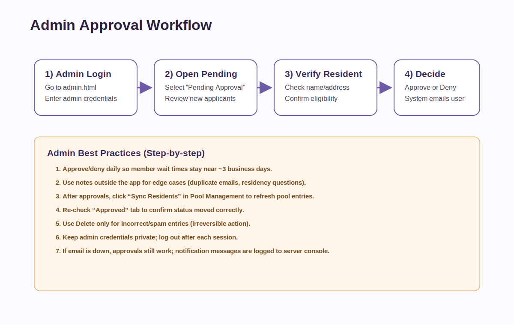
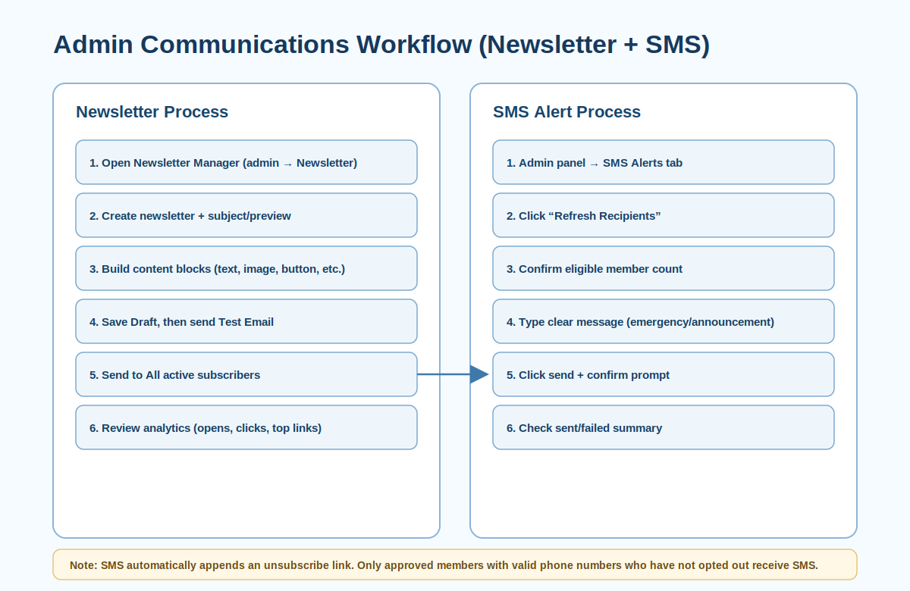

# Glenridge Community HOA Website — Admin Manual

_Last updated: April 19, 2026_

## Who this guide is for

This manual is for **HOA admins** managing memberships, communications, and operations.

---

## Admin responsibilities at a glance

- Review and process pending member signups
- Keep approval turnaround near **~3 business days**
- Manage pool access records and schedules
- Send newsletter communications
- Send SMS alerts (admin-only)
- Maintain secure admin access

---

## 1) Logging in to admin panel (step-by-step)

1. Open `admin.html`.
2. Enter admin username/password.
3. Click **Log In**.
4. Confirm dashboard loads (Pending/Approved/Denied tabs visible).

Security note: Log out after each session.

---

## 2) Approving member accounts (step-by-step)

1. Open **Pending Approval** tab.
2. Review each request details:
   - Name
   - Email
   - Address
   - Phone (if provided)
3. Decide:
   - Click **Approve** for valid residents.
   - Click **Deny** for ineligible/invalid requests.
4. System updates member status and sends notification email.
5. Verify status under **Approved** or **Denied** tabs.

### SLA recommendation

- Check pending queue at least once daily.
- Goal: approve/deny within about 3 business days.

---

## 3) Managing users

### Delete user

1. Locate user in any tab.
2. Click **Delete**.
3. Confirm permanent removal.

Use deletion only when necessary (spam/test/duplicate/invalid accounts).

---

## 4) Pool management (step-by-step)

1. Open **Pool Management** tab.
2. Use **Sync Residents** to import approved residents/family into pool members.
3. In sub-tabs:
   - **Pool Members**: add/edit/remove members
   - **Schedules**: define recurring, one-time, holiday, unlimited access
   - **Entry Types**: maintain categories (Resident, Vendor, etc.)
   - **Access Check**: validate who can enter by date/time

Tip: Re-sync residents after batch approvals.

---

## 5) Newsletter management (step-by-step)

1. Open **Newsletter** from admin panel.
2. Click **+ New Newsletter**.
3. Enter subject + preview text.
4. Build content blocks (text/images/buttons, etc.).
5. Click **Save Draft**.
6. Send **Test Email** to verify layout and links.
7. Click **Send to All** to publish.
8. Review analytics for opens/clicks.

---

## 6) SMS alerts (admin-only, step-by-step)

1. In admin panel, open **SMS Alerts** tab.
2. Click **Refresh Recipients**.
3. Confirm eligible recipient count.
4. Write concise message content.
5. Click **Send SMS to Eligible Members**.
6. Review results (sent / failed / eligible).

### SMS targeting rules

Only members are included when they are:

- **Approved**
- Have a **valid phone number**
- Have **not opted out** of SMS

### SMS compliance behavior

- Every outbound SMS includes an opt-out link.
- Members can opt out from profile or unsubscribe link.

---

## 7) Daily admin checklist

1. Process pending approvals.
2. Verify no blocked onboarding requests.
3. Sync residents to pool if approvals were made.
4. Send urgent announcements via SMS as needed.
5. Prepare newsletter communications when required.
6. Log out and secure admin credentials.

---

## 8) Troubleshooting

### Port or startup issue

- If server won’t start and port 3000 is in use, stop existing process using the port and restart.

### Email not sending

- Verify SMTP settings in `.env`.
- If SMTP fails, system may log email payloads to console for fallback diagnostics.

### SMS not sending

- Verify Twilio values in `.env`:
  - `TWILIO_ACCOUNT_SID`
  - `TWILIO_AUTH_TOKEN`
  - `TWILIO_PHONE_NUMBER`
- Ensure SID format starts with `AC...`.

---

## 9) Security and governance recommendations

- Restrict admin credentials to authorized HOA leadership only.
- Rotate admin password periodically.
- Avoid sharing exported lists outside approved HOA workflows.
- Use “Delete” carefully (irreversible action).
- Keep communication content factual and resident-relevant.
