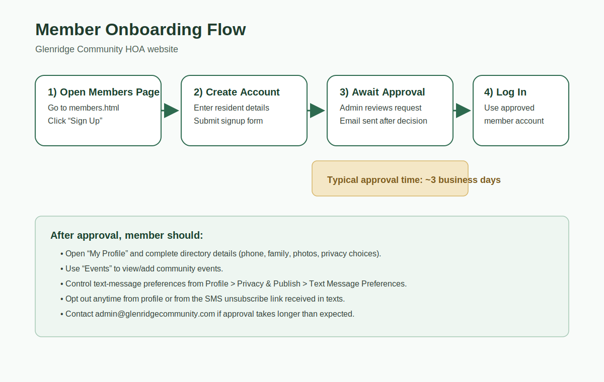
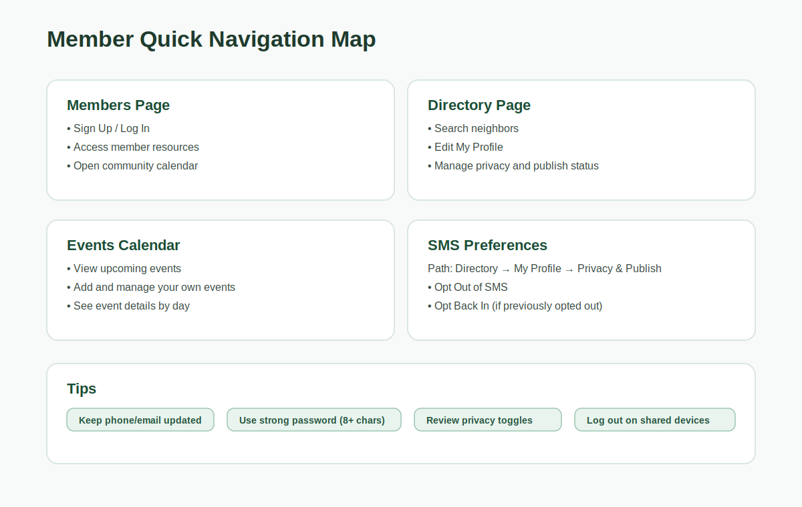

# Glenridge Community HOA Website — Member User Manual

_Last updated: April 19, 2026_

## Who this guide is for

This manual is for **community members/residents** using the HOA website.

## Quick start

1. Open the website home page.
2. Go to **Members**.
3. Click **Sign Up** and complete your account details.
4. Wait for admin approval (typically **~3 business days**).
5. Log in and update your profile.

---

## 1) Creating your member account (step-by-step)

1. Go to `members.html`.
2. Click **Sign Up**.
3. Fill in:
   - First name
   - Last name
   - Email address
   - Glenridge address
   - Phone (optional but recommended)
   - Password and confirmation
4. Submit your registration.
5. You will see a confirmation that your account is pending approval.

### Approval timeline

- Admin review usually takes **about 3 business days**.
- In some periods it can take a little longer.
- You will receive an approval/denial email after admin review.

---

## 2) Logging in after approval

1. Return to `members.html`.
2. Click **Log In**.
3. Enter your approved email and password.
4. Click **Log In** to access member resources.

If you forgot your password, use **Forgot your password?** to reset it.

---

## 3) Member resources you can use

After login, you can access:

- **Events Calendar** (view and submit events)
- **Member Directory** (browse neighbors)
- **Profile Management** (control what appears in the directory)
- **Newsletter content** (member-facing communications)

---

## 4) Updating your profile and directory visibility

1. Open `directory.html`.
2. Click **My Profile**.
3. In tabs, update:
   - **Household Info**
   - **Family & Pets**
   - **Social Links**
   - **Photos**
4. Use visibility toggles for optional fields.
5. Click **Save Info**.

### Important directory behavior

- Your **name** and **address** are core profile elements.
- You can choose which optional fields are shown.
- Use **Do Not List** to hide your household from directory listings.

---

## 5) Text message (SMS) preferences

You can control HOA text-message notifications.

1. Open `directory.html`.
2. Click **My Profile**.
3. Open **Privacy & Publish** tab.
4. Find **Text Message Preferences**.
5. Click:
   - **Opt Out of SMS** (stop texts), or
   - **Opt Back In** (resume texts).

You can also unsubscribe directly from the opt-out link included in HOA text messages.

---

## 6) Using the events calendar

1. From the Members area, open **Events Calendar**.
2. Browse by month/day.
3. Click **Add Event**.
4. Enter title/date and optional time/location/description.
5. Save.

Tip: You can delete events you created.

---

## 7) Troubleshooting

### I can’t log in

- Confirm your account has been approved.
- Check email/password spelling.
- Use password reset if needed.

### I never got approved

- Wait about 3 business days first.
- Then contact: `admin@glenridgecommunity.com`

### I’m not receiving SMS

- Confirm your phone number is valid in profile.
- Confirm you are not opted out.
- If still not receiving, contact HOA admin.

---

## 8) Best practices for members

- Keep your phone and email current.
- Review your profile privacy settings regularly.
- Log out on shared/public computers.
- Only upload photos/content you have permission to share.
